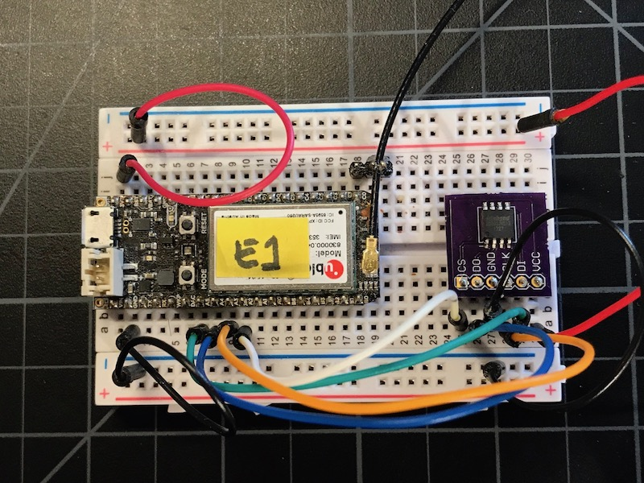

# SpiFlashRK

*Particle library for SPI NOR flash memory chips*

This library provides access to SPI NOR flash chips on the Particle platform. It's a low-level access that allows byte-level write-to-0 and sector-level erase-to-1.

You probably won't use this library directly; it's intended by be used as the hardware interface for a library that provides easier access, wear-leveling, flash translation, etc.. I recommend the SpiffsParticleRK library.

## Instantiating an object

You typically instantiate an object to interface to the flash chip as a global variable:

```
SpiFlashISSI spiFlash(SPI, A2);
```

Use an ISSI flash, such as a [IS25LQ080B](http://www.digikey.com/product-detail/en/issi-integrated-silicon-solution-inc/IS25LQ080B-JNLE/706-1331-ND/5189766). In this case, connected to the primary SPI with A2 as the CS (chip select or SS).

```
SpiFlashWinbond spiFlash(SPI, A2);
```

Use a Winbond flash, such as a [W25Q32](https://www.digikey.com/product-detail/en/winbond-electronics/W25Q32JVSSIQ/W25Q32JVSSIQ-ND/5803981). In this case, connected to the primary SPI with A2 as the CS (chip select or SS).

```
SpiFlashWinbond spiFlash(SPI1, D5);
```

Winbond flash, connected to the secondary SPI, SPI1, with D5 as the CS (chip select or SS).

```
SpiFlashMacronix spiFlash(SPI1, D5);
```

Macronix flash, such as the [MX25L8006EM1I-12G](https://www.digikey.com/product-detail/en/macronix/MX25L8006EM1I-12G/1092-1117-ND/2744800). In this case connected to the secondary SPI, SPI1, with D5 as the CS (chip select or SS). This is the recommended for use on the E-Series module. Note that this is the 0.154", 3.90mm width 8-SOIC package.


```
SpiFlashP1 spiFlash;
```

This is the external flash on the P1 module. This extra flash chip is entirely available for your user; it is not used by the system firmware. You can only use this on the P1; it relies on system functions that are not available on other devices.


## Connecting the hardware

For the primary SPI (SPI):

| Name | Flash Alt Name | Particle Pin | Example Color |
| ---- | -------------- | ------------ | ------------- |
| SS   | CS             | A2           | White         |
| SCK  | CLK            | A3           | Orange        |
| MISO | DO             | A4           | Blue          |
| MOSI | D1             | A5           | Green         |


For the secondary SPI (SPI1):

| Name | Flash Alt Name | Particle Pin | Example Color |
| ---- | -------------- | ------------ | ------------- |
| SS   | CS             | D5           | White         |
| SCK  | CLK            | D4           | Orange        |
| MISO | DO             | D3           | Blue          |
| MOSI | D1             | D2           | Green         |

Note that the SS/CS line can be any available GPIO pin, not just the one specified in the table above.

- Electron using Primary SPI



- Photon using Secondary SPI (SPI1)


- Photon using Primary SPI and a poorly hand-soldered 8-SOIC adapter


## The API

The API is described in the SpiFlashRK.h file. But you will rarely need to use the low-level API directly.
